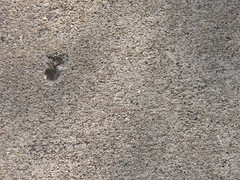
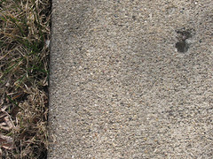
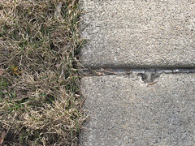

Overt is maybe not the best way. Really, but subtlety is probably best left to the professionals. No one knows what you're talking about. Even I know that vague ≠ ambiguous ≠ subtle. Really really, at one point I thought I'd attempt to make this lippogrammatic. You know I'm failing miserably, don't you?

Nor was the selective lippogram the entire problem. If, every time you started writing something, you said exactly the thing you didn't want to say, wouldn't you stop too, well wouldn't you? Now I know what the answer probably should be, but that doesn't mean I accept it. Jeez, can you say "denial"? All the damn time.

Even if I were able to say exactly what I want to say, do you think I would say it, well do you you? Listen, listen, listen, there are concepts, there are ideas, and there are ways of expressing them, and probably I shouldn't even attempt to touch some of them. Funny, I thought you didn't give a shit (but I do).

