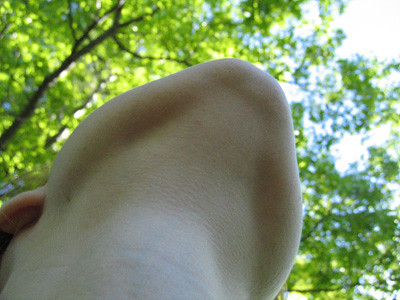

"We study the order of things, says Browne, but we cannot grasp their innermost essence. And because it is so, it befits our philosophy to be writ small, using the shorthand and contracted forms of transient Nature, which alone are a reflection of eternity."

"I still see quite clearly the massive, elaborately carved sideboard, on one side of which stood a glass case containing an arrangement of artificial twigs, colorful silk bows and tiny, stuffed humming-birds, and on the other a conical pile of china fruit."

—W.G. Sebald

  
This photo was taken on Monday, May 30, 2004 at 2:50 p.m. It was taken on the only long walk of the day, and in the same park as yesterday's photo of the water from February fifth. This was the walk of the wild mushroom; the church party blaring Xtian music; hacky-sacking hippies; fat-assed bicyclists; ugly read-headed children; "Look! It's a fruit store!"; another store that smelled of farts; "I don't care where we go, I don't care what we do. I don't care, pretty baby, just take me with you."; flowers on trees that smelled like inner tubes; sitting in the grass and looking up at the trees; a small twist cone, a chocolate-dipped cone, and a small Coca-Cola.
