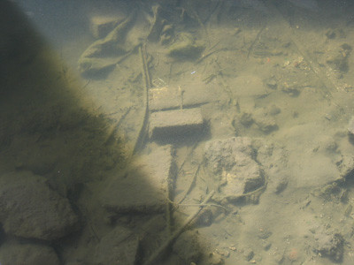

> But the fact is that writing is the only way in which I am able to cope with the memories which overwhelm me so frequently and so unexpectedly. If they remained locked away, they would become heavier and heavier as time went on, so that in the end I would succumb under their mounting weight. Memories lie slumbering within us for months and years, quietly proliferating, until they are woken by some trifle and in some strange way blind us to life. How often this has caused me to feel that my memories, and the labours expended in writing them down are all part of the same humiliating and, at bottom, contemptible business! And yet, what would we be without memory? We would not be capable of ordering even the simplest thoughts, the most sensitive heart would lose the ability to show affection, our existence would be a mere neverending chain of meaningless moments, and there would not be the faintest trace of a past. —W. G. Sebald

  
This photo was taken on Saturday, February 5, 2005 at 2:39 p.m. I don't expect that date or time to mean much to anyone reading this, so let me just say that it was taken on the second long walk of the day, the second long walk and talk. On the first long walk, things were hypothesized. On the second long walk, things were finalized. Later that evening, I went for a 3+ hour drive on which almost nothing was said. Today, I was going to write about how there is no way of knowing what kind of post will engender commentary—except that the post I want people to comment on will without fail receive no commentary whatsoever. Instead, I'm . . . ah . . . what am I writing about?
