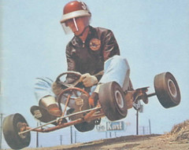
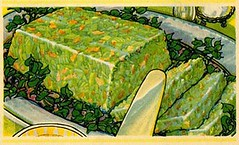

  
Terry pulled up his socks before entering the room. Terry always pulled up his socks before entering a room. Terry pulled up his socks before entering any room and that meant Terry pulled up his socks as he was exiting a room and that meant Terry was often to be found bent over in doorways. Terry was often in the way.

Terry pulled up his socks before entering the room. Racquel could see most of him through the doorway, but couldn't quite tell what he was doing, she could just see he was bent over. She wondered why he was pausing before coming to speak with her. She could understand perhaps pausing to pop a breath mint into one's mouth, but to bend over, especially when one was wearing loafers (she couldn't see laces from where she was seated). . . . She couldn't understand it.

After Terry entered the room and exchanged a few words with Racquel, he left. As he was leaving, he bent over to pull up his socks, thus giving Racquel a mostly unwanted view of his posterior. Racquel was not offended. She was, however, even more curious about Terry's somewhat bizarre behavior. She couldn't tell why he was bending over. Terry, of course, had no idea he was bothering anyone at all. In fact, Terry would have been surprised to learn he paused to pull up his socks before entering a room.

vs.

  
Before declaring himself supreme ruler of the mountain (which was just a pile of dirt behind the Mortenson's house), Serge paused to adjust the waistband of his underwear, thus giving Emily an opportunity to unseat him. Serge realized his knee was bleeding when he stopped rolling. He immediately screamed, "Blood!" which caused the other children to stop and stare at him. Serge looked around at them, fear and hatred burning behind his eyes. He then noticed everyone had scuffed and bleeding knees. Serge adjusted the waistband of his underwear and mounted an attack on the top of the hill, where Emily was still king.

Two days later, while digging through the trash behind the Cuthburt's house, Serge was approached by Emily, who had a look on her face unlike anything Serge had seen before. He dropped the grimy copy of Juggs magazine he had just found, and stared into Emily's face. Emily looked at Serge, down at the trash, and back up at Serge. She adjusted the waistband of her underwear. She spat into the dirt of the alley. Some muddly spittle splashed up onto Serge's shoe. Emily turned around and walked away.

The day before their game of King of the Mountain, when he had so ruthlessly deposed her by shoving a mud pie in her face, down her shirt, and down her pants, Serge and Emily had spent the day catching frogs down by the bend in the creek. When Serge had six frogs, and Emily only had five, she grabbed one of his, pulled off its legs and arms, and threw its body into the creek. "There," she had said, "now we're even."
