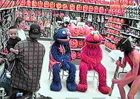
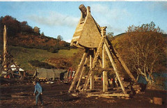

  
Daniel said he didn't know the wolves were dangerous. He said he thought they were just "sharper dogs." Marjorie spanked her dolly again and again because the dolly wouldn't hold her pinkie finger just so while sipping tea. Frankie told his mother he tied the bunnies to his feet so he could jump higher. Sally refused to stop making faces at the teacher.

vs.

  
Rolling down the window with one hand, and lighting a cigarette with the other, Jared completely forgot about the steering wheel for nearly 30 seconds, but still managed to retake control of his careening '65 Volkswagen before it flew off the edge of the Gene R. Dipschwang Memorial Bridge. Jared then stopped the car in the middle of the bridge, and while finishing his cigarette, calmly took a moment to consider the life and accomplishments of Gene R. Dipschwang, in honor of whom the bridge had been built. Stubbing the cigarette out in the ashtray, and hawking some phlegm out of the window, Jared put the car into gear, and headed back the direction he had come.
