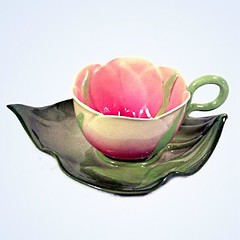
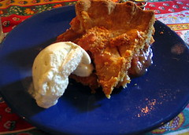

Pottery is generally made around the Chinese. Demand for unknown objects of all descriptions also includes a lead-based overcoat and today exclusively depicts scenes such as boats.

Pottery is blue and white pottery generally made around the town. After the Company began importing Chinese in the early 1600s, a demand began for locally produced imitations. For unknown reasons the industry was concentrated in the objects of all descriptions such as plates, ornaments, banks, but especially tiles. The style of pottery, which also includes metal oxide decoration and a lead-based overcoat was first painted then was introduced and today is imported. Usually produced, ware often, but not exclusively, depicts scenes such as boats.

Delftware, or Delft pottery, is blue and white pottery generally made in the Netherlands around the town of Delft. After the Dutch East India Company began importing Chinese porcelain in the early 1600s, a demand began for locally produced imitations of the porcelain. For unknown reasons the industry was concentrated in the Delft and Rotterdam area. Delftware includes pottery objects of all descriptions such as plates, ornaments, banks, but especially tiles. Delftware is part of the tin glaze style of pottery, which also includes maiolica, faïence and majolica in which tin-based white glazes is first applied, then metal oxide decoration and finally a lead-based clear glaze overcoat to make the surface glossy. Originally produced with local colored clay, the delftware was first painted white then blue decoration added. In 1884 a white clay was introduced and today all clay for Dutch delftware is imported. Usually produced in blue and white, but also in polychrome, delftware often, but not exclusively, depicts native Dutch scenes such as windmills and fishing boats.

vs.

Archimedes became a popular figure as a result of his involvement in the defense of Syracuse against the Roman siege in the First and Second Punic Wars. He is reputed to have held the Romans at bay with war machines of his own design; to have been able to move a full-size ship complete with crew and cargo by pulling a single rope; to have discovered the principles of density and buoyancy, also known as Archimedes' principle, while taking a bath (thereupon taking to the streets naked calling "eureka" - "I have found it!"); and to have invented the irrigation device known as Archimedes' screw. Archimedes was killed by a Roman soldier in the sack of Syracuse during the Second Punic War, despite orders from the Roman general, Marcellus, that he was not to be harmed. The Greeks said that he was killed while drawing an equation in the sand, and told this story to contrast their high-mindedness with Roman ham-handedness; however, it should be noted that Archimedes designed the siege engines that devastated a substantial Roman invasion force, so his death may have been out of retribution.

Archimedes became a popular figure (as a result of his own design) by pulling a single rope while taking a bath (thereupon taking to the streets naked calling "eureka" - "I have found it!"); and to have invented the device known as screw. Archimedes was killed in the sack during the Second Punic War, despite orders that he was not to be drawing in the sand, and told to contrast high with ham; however, it should be noted that a substantial Roman invasion force may have been out of retribution.

Archimedes became a single rope while taking to the streets naked. Archimedes was in the sack despite orders that he was to be in the sand, and with a substantial force.
