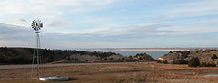
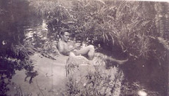

The picture shows a woman in three-quarters profile. The viewer mostly sees the back of her head and her hair pulled up into a small bun. It is possible, but barely, to discern a smile on her face. She is holding a book in her hands and flipping through the pages, which are blurred, but she is not looking at the book. She is looking (and smiling) at something in front of her, something the viewer cannot see. Sadly, it is not possible to change the perspective of a photograph. One cannot simply look around the corner and know at what or whom the woman is smiling. The viewer assumes she is smiling. The viewer cannot see her eyes. Maybe she is grimacing. Maybe she is baring her teeth in fear and rage. Maybe she is making a face because she does not want to be photographed and maybe this is why she has been photographed in three-quarters profile. But the viewer assumes she is smiling. The viewer assumes she is happy because the viewer wants her to be happy and smiling. The viewer assumes she is happy because the viewer himself wants to be happy. The viewer, however, is not happy. The viewer is almost never happy. The viewer is unhappy because, sadly, it is not possible to change the perspective of a photograph.

vs.

[no comment. the image and title speak for themselves.]
