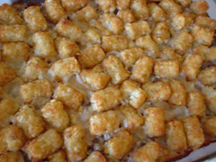

Diane had to explain three times to Geoff that teeth had nothing to do with it, but Geoff could not get it into his (thick) head that a woman might possibly know something he didn't. Diane, who viewed chauvinism as a sickness in much the same way she viewed childhood as a sickness--something to be grown out of--merely paused to breathe in through her nose and out through her mouth before embarking on a fourth, but not final, attempt at explaining how it was that yes, teeth could be part of the overall equation, but that ultimately, teeth had nothing to do with it at all. Geoff stared blankly at her breasts. His mouth was open slightly. He nodded but didn't listen. He thought vaguely that if he agreed with her, perhaps she'd sleep with him. He looked up at her mouth and nodded a little more vigorously. He thought she had a pretty mouth, but that she had even prettier breasts, so he looked back down at them. Diane watched Geoff's open mouth, continued to explain, and thought maybe if Geoff were to look her in the eye for more than three seconds, she might sleep with him.

vs.

baked spinach tuna beef and noodle best ever chicken cabbage roll creamy potato mexican baked fish pork chop sausage-potato zucchini shepherd's pie amish yumazuti baked spaghetti squash with beef and veggies bangers and mash bbq beef beef and bean beef and biscuit beef and noodle beef and pita beef bourguignon beef burger pie with cheese puff beef florentine beef nacho beefaroni bierock bierox burrito pie cabbage roll calico bean cheeseburger and fries cheeseburger and noodle cheeseburger pie cheesy beef and bean cheesy beef and rice cheesy chipped beef chile relleno chilli dog chow mein noodle cowboy skillet czech stuffed green pepper divine double cheese dutch leek easy mexican el dorado beef empty wallet french onion garlic lovers beef gluck green chilli haviland glop italian meatball sandwich jacob's coat jeannie's famous potato hamburger kielbasa and veggies layered eggplant hamburger marcia's company meatball bread pudding mexican botana platter musaka oklahoma tamale overnight pilly cheesesteak potatochip putzwutz reuben saucy beef and veggie savory tater tot scrumptious beef and potato serbian ground beef, veggie and potato serbian pork and beef shearer's mince and potato hot pot slumgullion sonny's tater tot southwestern haystacks spanish rice bake spicy squash taco cornbread taco pie talerine tamale tater tot bake three bean throw together mexican thunderbird traditional reuben upside down pizza velveeta cheesy beef wild rice and beef yuck-a-muck yummy beef zippy beef
