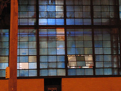
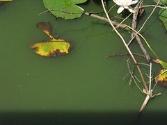
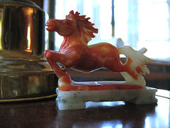

1.1 This was idea of all Bens. Blames it before you blames me. Or blames it for 51% at least. I assume that it is my whole disturbance, which I took and decided the idea to run with it. Blames me for the photos. But definitely debt Ben for the syntactic verruecktheit and idomatic the bricolage.

2.1 This weekend was given to me a photo by me graduating of the High School. In it you can see that my diploma was already given to me and that I am in, someone to shake hand. They can also see that I was not educated from much at one time. Now regarding the photo, I find it with difficulty to believe that I looked at all as. I surprise also, me which the latch plate happened, which I carry in the illustration. Unfortunately has I unite important and ehrfuerchtige latch plates over the years lost. Regarding, how frequently I carry a latch plate now, I am unfortunately surprised at my use by the word ",", but I assume that I was attached always emotional to things. There is no reason for example thereby I the small, Penguinfingermarionette holds, which lies on a shelf over me. I not even know, where I received it. And it continues nevertheless, there living.

3.1 I hate dinners me form. Let me explain: I hate explain out, I will form for what for dinners. I hate, as expensively it is to eat well, and I long themselves after the days, when the Rich was fat and was thin arms. Now and I step also near at social comment here somewhat, who am not I oath that I would never do at all in this blog, now the only affordable ones meal elections those, which form you fatter than nut/mother Cass, those by the way died to strangle on a Truthahnsandwich although it is fair really comfortably and somehow poetically to believe.
