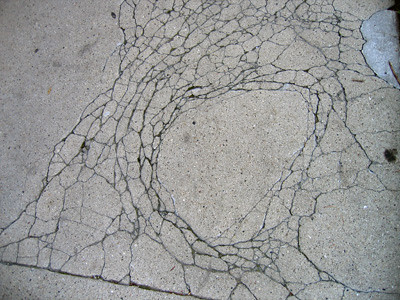
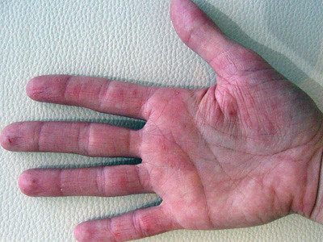

The photograph of my sister's hand (on a bench in the recent addition to Minneapolis' Walker Art Center) didn't turn out as well as I would have liked. The tracing-paper-thinness of her skin, the myriad lines and cracks, the spots that look like cuts but aren't—none of these things is as obvious in the photograph as in real life. Blame the light. Blame the photographer.

It didn't occur to me until after I had picked the photographs that they are connected. I swear. It wasn't until I was typing the html for the second photo that I thought, "Oh . . ." Let's hear it for artistic juxtaposition! Hip hip . . . !

Usually, by the third paragraph, in cases such as this, the author begins to spin the metaphor, begins subtly to explain the deep hidden meaning to the reader: The cracked concrete and my sister's eczematous hands are meaningful because—

In the fourth paragraph, if s/he's good (or perhaps just cocksure), the author might attempt to extend the metaphor or the deep hidden meaning of the juxtapostion of his sister's hands against the cracked concete to his entire family, their trip to Minneapolis, their interactions, their etc.

This author will attempt neither metaphor/deep hidden meaning, nor an extension of same.

I ain't no dummy.
