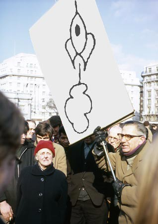
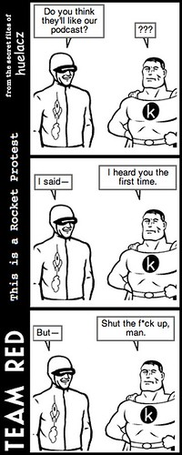

The above title is a link to a collaborative [podcast](http://en.wikipedia.org/wiki/Podcasting) created by mkudlacz of [This is a Pocket Protest](http://www.taco-robot.com/kudlacz/) and myself.\* Mister mkudlacz regularly creates such podcasts, and if you have the capability, you should subscribe to his sonic newsletter. I'm very pleased with how our collaboration turned out, and hope to work with him on other things in the future. Here is what you will find, should you listen to our little bit of aural insanity:

afternoon JONATHAN RICHMAN  
bat macumba OS MUTANTES  
native numb ENON (good morning amerika HARDWARE SOUNDTRACK (w/iggy pop as angry bob))  
denial NEW ORDER  
super NEU!  
we are 138 THE MISFITS  
kid charlemagne STEELY DAN  
doctor wu MINUTEMEN  
baron saturday THE PRETTY THINGS  
marquee moon KRONOS QUARTET  
i don't believe you've met my baby THE LOUVIN BROTHERS  
the contenders THE KINKS  
junco parter JAMES BOOKER  
flight of the bumblebee ARCADI VOLODOS  
love letters KETTY LESTER

\*If you are not familiar with the term "[podcast](http://en.wikipedia.org/wiki/Podcasting)," please follow the link in the word either here or above. If you are not technologically able to download or listen to a podcast (and there's absolutely no shame in that--just because we're big, geeky nerds doesn't mean you have to be), a downloadable mp3 can be found [here](http://rocket2nowhere.com/mp3s/ThisIsARocketProtest.mp3 "This is a Rocket Protest") (beware: the file is large and not so much dial-up friendly!).

