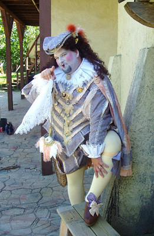

2:15 a.m. - 4:14 a.m.

You are stylish, social, and effete. You ride the crest of the wave of any particular fashion, discerning it before it swells, and discarding it before it breaks. You are a simpering fop, not particularly athletic or of great physical stature, but to disregard you is to underestimate your insidious talents. Your weapon is not the sword, but the _bon mot_ and the girlish titter. You are witty, cruel, and conniving. You find and exploit weaknesses in emotion, intelligence, or social standings. You perceive the complexities of social interaction incredibly acutely—so much so that you become incredibly listless and bored around those who speak or act plainly. Intrigue and politics are the venue in which you were clearly bred to thrive. Failure in your endeavors to do so is not an option to you, especially because such a venue is filled with individuals of a similar disposition to you, and they would eat you alive at any sign of weakness, just as you would them.
