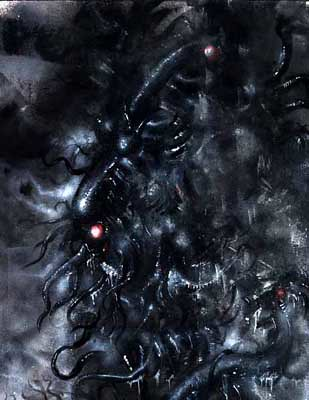

2:15 p.m. - 4:14 p.m.

You are a seething mass of evil, borne out of the Carven Rim and through the Windowless Solids of Five Dimensions. Your irresponsible whisperings about the Nameless Cylinder penetrate into the minds of the willful and weak alike, and render bold men useless with abject terror. The foetid aura that surrounds you—your stinking, rotten _presence_—demands nothing less than the full subservience of your wretched minions, whom you send out on loathsome errands, usually to the Disney Store. Gaze not upon us, O thou lumbering chaos!
