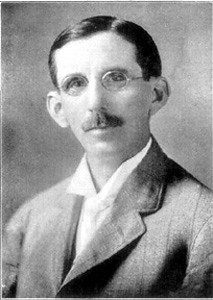

4:15 p.m. - 6:14 p.m.

You are calm and thoughtful. You often find yourself surrounded by small children who have a tendency to freak out, and whose eyes and mouths become exceedingly, impossibly large at such times. You clean your glasses while squinting or you rub your chin. You narrowly avoid being hit in the head with flying objects while cleaning/squinting or chin stroking. If you had a nickel for every time someone said to you, "You know, it's crazy, but it just might work!" you'd be rich beyond your wildest dreams. You have forgotten how many times you have averted disaster by being calm and thoughtful (and also somewhat absent minded). You have forgotten that you have ever averted disaster by being calm and thoughtful (and also somewhat absent minded). Every crisis is a new problem to you. You know what the bubbling liquid in the test tube is. You don't know how your glasses always manage to get so dirty. You don't know who these large-mouthed, large-eyed, screaming children are, they're certainly not yours, you've never been married or even really had sex except for maybe that one time with the tenacious, stubborn, scrappy reporter who helped you avert disaster by being tenacious, stubborn, scrappy and unbelievably gorgeous, but no one really knows if the two of you knocked boots, and the loud, orphan children who are always following you around and getting you into trouble just giggle uncontrollably every time you mention her name. Oh well.
