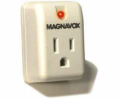

8:15 p.m. - 10:14 p.m.

You are a lifeless, non-human thing that has been granted the blessing of human characteristics! Where before you would have been “content” in your “unconsciousness,” you are now charged with maintaining not only consciousness, but also a code of morals/ethics. Where before you had nothing but being, you now have being _and_ becoming as well as the desire to tell the difference between the two. More importantly, you now have desire (and either the fulfillment or denial thereof). Where before you had no sense of self, you now have a self and all the doubts and worries that go with it. Now that people around you have recognized your humanity, you can no longer go back to being the inanimate object you were before. Because you are technically not alive, technically, you cannot now die. You get to be human-like forever! Lucky you!
