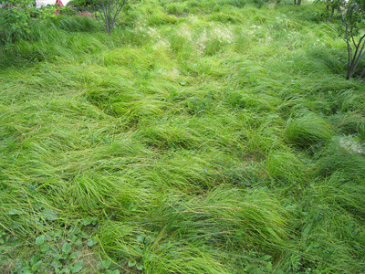

And so that, dear Reader(s), is the [New Zodiac](http://rocket2nowhere.com/blahg/category/zodiac) by [sh](http://www.rocket2nowhere.com/blahg/about) and [bigjesus](http://static.flickr.com/34/65973814_af7c97081b.jpg). I hope you found it enlightening and/or entertaining on some level at least. We (and when I say "we," I really mean "I") now return you to your semi-regularly scheduled program, which will include (but is not, or will not be, limited to):

More telephone conversations like the one I just overheard (well, half of it anyway): "Hello? -- This is she. -- What?!? -- You have my rabies certificate? -- What is the question? -- Yes, I am. -- Ok, thank you."

More of my own digital photography (as opposed to things mined from Google):  

More or less of the "award-winning," first-class, top-notch, liberal-lovin’, muckraking, inside (and below) the Beltway, "journalism" you’ve come to rely on as part of your daily, intarweby sustenance! Huzzah!

More blurring the line.

More clever high jinks and shenanigans!

More moreness! Less lessness! More or less more and less moreness and lessness!

I hope you’ll join me!
