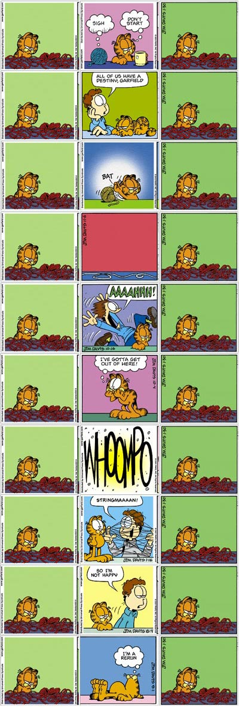

You should visit the [Garfield Randomizer](http://www.cs.washington.edu/homes/natetrue/gar.html) (which, unsurprisingly, has been served with a cease and desist letter and so no longer works--there is still something there worth salvaging though (for the intrepid user only) -sh 04 Feb 2006). You may or may not want to geek out like me and edit your randomizations.

