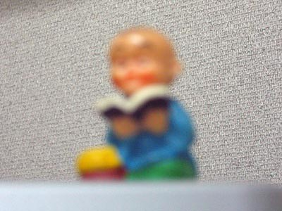
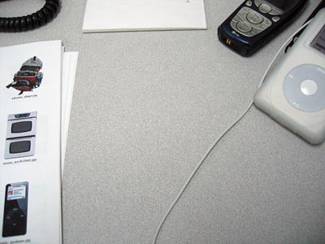

My website, [rocket2nowhere.com](http://www.rocket2nowhere.com) (not to be confused with this, my blog) recently underwent a major upgrade. Here are the particulars:

1. The image on [the bio page](http://www.rocket2nowhere.com/bio.html) has been changed.
2. Certain navigational weirdnesses within ["A Determination of Parts"](http://www.rocket2nowhere.com/determination/text%20pages/determincover.html) have been fixed.
3. All of the [memos](http://www.rocket2nowhere.com/memos/monthlyindex.html) (written nearly every weekday between May 2003 and May 2004) have been added in pdf form.

The only thing that's changed here (in the blahg) is that I've added a link to the right to information about the class I'll be teaching in April at the MCA.

So please visit my website and read some stuff and then let me know what you think. Please also join me in thanking my site's host, Mr. A. Basket. Please take a bow, kind sir.

Coming up next: A return to form.

