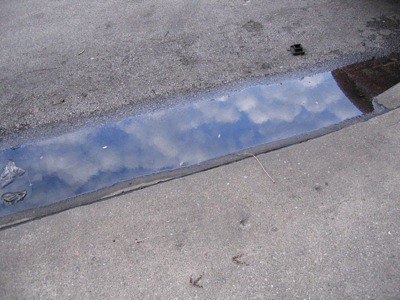

“What is interesting, as always, is the aftermath.” —Ben Marcus, The Age of Wire and String

1. Home  
   1.1. He sighed as he placed his left index finger on the light switch and looked down at her.  
   1.2. She closed her eyes and turned her face away from him as he obliviously dug his thumbnail into the rind of the orange.  
   1.3. They didn’t feel it move through them, but they saw the stain as it began to spread.

2. Work  
   2.1. Not noticing the puddle of water at his feet, he prepared to press the buttons required to receive a candy bar.  
   2.2. He looked his boss squarely in the eye, and said, “Good morning, Sir.”  
   2.3. She hit the send button.

3. At Large  
   3.1 He took the very center of the french fry between both forefingers and thumbs and squeezed, causing the hot center to squirt out like pus from a pimple.  
   3.2 They shook hands and agreed that perhaps everyone else was quite foolish for not listening to their warnings.  
   3.3 As she stepped from the curb, she sneezed.
