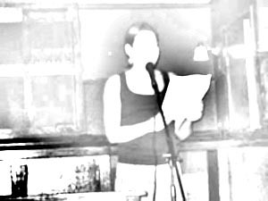

A friend of mine, Megan, has just had three very short (may god forgive us for the terms micro- and flash-fiction (?)) published on the [Conjunctions](http://www.conjunctions.com/) website. They are tight, controlled, funny, and just weird enough to make you scratch your head with befuddled pleasure. I like them very much. Here's an excerpt from "The Cyclops and His Eyeball, Starring Myself," which has a certain fractured-fairy-tale-ness about it:

> It was one of those days when you feel like the whole Kingdom's gone ping-pong and you're the lone chanteuse on a frazzled stage.  
> I was lost in the forest again in my new velvet frock, skipping halfheartedly about in search of a lime gimlet when—lo and behold—this tree-trunk opens up into a staircase!  
> At the bottom was this joint called The Rectory. It was a little gimmicky—packed with those expedient, rough-around-the-gills types I always go for.  
> --Whaddaya say we hole up in one of those cozy confessionals for a few hours, I said to one I had my eye on, but he was too busy buying bubble gum brainwashers for the flock of underaged wood nymphs who'd invaded. The bartender came to my rescue; fed me gimlets until every oaf in the place was drowning in bedazzling good looks.  
> I woke up the next afternoon with my frock in a ball on the floor and the Cyclops next to me in bed, nibbling away at my basket of cupcakes, licking frosting off his fingers.

Here's the [link](https://conjunctions.com/articles/megan-martin-02-28-2006/) to the stories. Go there. Read. Enjoy. Send me positive comments, and I'll pass them on to Megan, who deserves them.

(image shamelessly stolen from [www.recroomers.com](http://www.recroomers.com) and then manipulated.)
