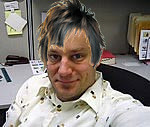

When my mother saw the above photo, she said, "What a shiny head you have!"

I have been (re)reading (and thoroughly enjoying) [_39 Microlectures: In Proximity of Performance_](https://ecommerce.tandf.co.uk/catalogue/DetailedDisplay.asp?ISBN=0415213932&ResourceCentre=SEARCH&RedirectPage=PerformSearch%2Easp&curpage=1) by Matthew Goulish which contains an entire chapter (microlecture) on hair. In subchapter 5.3 "Learning How to Leave the World," Goulish writes:

> Could we then say this about hair: it locates the confusion of the public and the private? It provides the surface on which the symbolic and the imaginary merge? Could we say that hair--confused, removed, or lost--habitates the inarticulate consciousness struggling for language, or struggling to leave language behind?

Which, if I understand it correctly, is just a fancy way of saying my head isn't shiny, it's either looking for something to say or it's looking for something not to say. Right?

