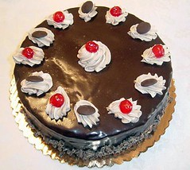

Kenny G of [WFMU](http://www.wfmu.org) fame (rather than the one who makes sweet, sweet love to a soprano saxaphone--or at least rather than the one who is famous for making sweet, sweet love to a soprano saxaphone) has been playing a rant/spoken word piece by Todd Colby called "Cake" on his radio show for the past ten years, and now he wants people to cover it. Follow the link in the title, then follow Kenny G's directions. I did.

p.s. tomorrow, March 23, 2006, is the first anniversary of this here blog. w00t.

\*image of cake shamelessly stolen from some website. I'm sorry.
