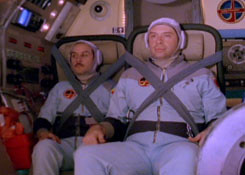

1. [Eat Me @ Reconstruction Room](http://www.recroomers.com/gigs/may032006/preview.html) curated by [Megan Martin](http://rocket2nowhere.blogspot.com/2006/03/lone-chanteuse-on-frazzled-stage.html)  
   Wednesday, may 3th, 2006 Black Rock bar  
   Damen and Addison  
   Chicago 8:00 pm  
   I'll be reading something.

2. Vegetarian Feast and Burning Karma Kabaret (part of Buddha's birthday celebrations)  
   Saturday, May 6, 2006 [Zen Buddhist Temple](http://users.rcn.com/chicagobuddha/locations/chicago/index.html)  
   1710 W. Cornelia Chicago  
   6:00 p.m.  
   $20 Please make reservations.  
   I'll be reading from ["A Determination of Parts"](http://www.rocket2nowhere.com/determination/text%20pages/determincover.html)

3. [Interkosmos](http://www.interkosmosmovie.com) (71 min, 2006), the new film by Jim Finn, will have its Chicago premiere at the: [Gene Siskel Film Center](http://www.siskelfilmcenter.org)  
   164 N. State Street  
    Sunday, May 7 @ 5:00 p.m. & Thursday, May 11 @ 8:15 p.m.  
    My voice is in it.

