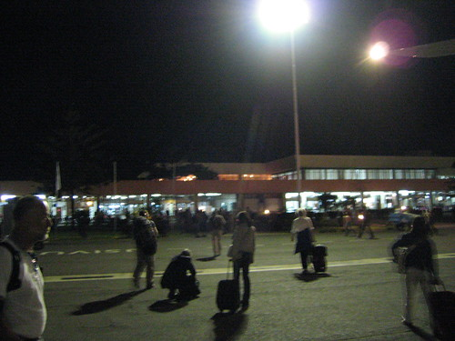
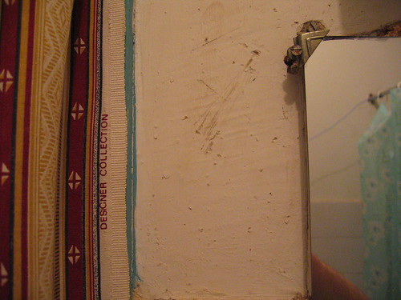

I am very tired and somewhat overwhelmed even though I haven’t seen anything yet. Besides long and long, the flight from Schiphol to Kilimanjaro International Airport (KIA) was uneventful—-very little turbulence, smooth landing. I guess Micah is a nervous flyer, and every bump made him jump. I hope he doesn’t see any real turbulence (but they told me a story earlier about flying over thunderstorms outside of Miami, so he has. Well, I hope he doesn’t see any this trip). [It’s strange coming to a place in the dark.](http://rocket2nowhere.blogspot.com/2006/07/into-illuminating-darkness.html) I have no real idea what any of this looks like. If not for our driver Fred, the fact that we drove on the left, the darkly lighted roadside bodegas (with outdoor pool tables under plastic tarps) and Tanzanians walking alongside the road, driving here from the airport wouldn’t have been that much different than driving through NE in the middle of the night (hmmm . . . if it weren’t for all of those many things . . .). Okay, I’m wasted tired. And the inundation starts in earnest tomorrow. I’ll take pictures of this room before going to bed.

