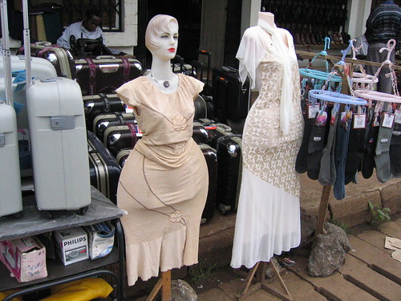
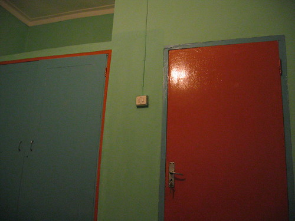

I slept relatively well. Woke up @ 2:30 a.m., went to the bathroom, tucked my mosquito netting back in, found a roach (or something that looked very much like one) inside the net with me, killed it, then tossed and turned and fretted (about insects, black people hating me, my future, and all the things I like to worry about) until sometime shortly after the first call to prayer (which was sung and not a recording like the 2nd call). Breakfast was instant coffee, toast, corn flakes, scrambled eggs on toast, juice, and the tastiest little bananas ever.

We just returned from our first walk through town. We got money changed, bought postage, visited an internet café, and paused for a Fanta. Pausing for the Fanta was key as it allowed me to catch up with myself (or it allowed my impressions to catch up with me). I was feeling very overwhelmed. After the Fanta and the walk back to the hostel, I am feeling much calmer and ready to engage with my surroundings.

We had a lunch of rice pilau and beef. The beef was very, very chewy. Stephen Mattowo came from his home and met us. He bought lunch. We then drove to Stephen’s home, which is a compound of sorts near Marangu on the slopes of Mount Kilimanjaro. We were greeted by two dogs and a very small, very dirty, very quiet little boy named Joseph. [We gave him a green Pioneer Seed cap.](http://static.flickr.com/53/165905075_2c1e3a67a7.jpg) After everyone got a cap (I took the only other green Pioneer Seed cap), we took a walk in the jungle. Much of the walk was along a small stream that ran along the side of a steep hill with a much larger stream at the bottom. I nearly slipped twice and was caught on thorns once. Before dinner, we had a snack of home-grown avocados and bananas (small ones). The first bite of avocado was very, very tasty, but as I kept eating, it became bad. Something about the taste . . . it was too much, too bitter, too rich? Dinner was a huge feast, and we were urged to eat a great deal. I’m still full. The toilet this house is a hole in the floor with a porcelain standing area and a flush tank. It is difficult to use. I wish I could describe the colors of this house, or the quality of the radio fuzz during and after dinner. I’m still feeling somewhat overwhelmed. I imagine the feeling will eventually go away. Maybe not.

(this is the 100th post. huzzah.)
