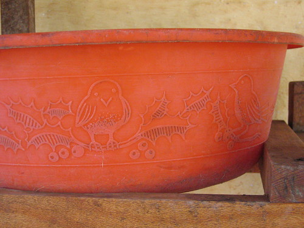
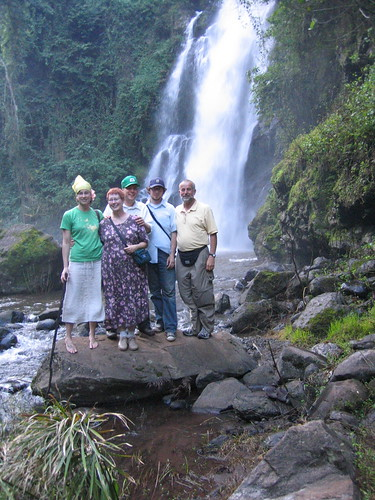

I did not come all the way to Africa to be kept awake half the night by something as pedestrian as a barking dog. The lowing of the cow, the bleating of the goat, and the crying of the bush babies was a more acceptable reason to be kept awake. And then every other sound. Every other sound. Every other goddamn sound. I have no idea how much I slept, but it wasn’t much.

We had a long, physical day. We ate a late breakfast, and then took a trip to Ahira church, which was founded by Father Althaus in 1894, and was the first Lutheran church in Tanzania (or just this region?). Stephen’s grandfather was among the first converts. The pastor showed us around, and we went up the new bell tower staircase. I went back down immediately, as I was very, very, very uncomfortable—which was strange since I had no trouble with natural (as opposed to man-made) heights.

We spent the middle part of the day at Bishop Moshi Secondary School, where Stephen is headmaster. We looked around, ate/drank tea, looked around, ate lunch. Then we drove up to the gate to the path up the mountain. We walked down and up and down. Mary Jo thought she wouldn’t made it. We were followed by a group of small children who, after we photographed them, called “chocolate?!?” after us. Then we drove to Ndoro Falls, and M.J., who had thought she wouldn’t make it on our little up and down and up walk, went all the way down the narrow, steep, slippery trail to the falls, and all the way back up. This time we were followed by four young boys who provided us with walking sticks. I tipped them $1.00 each. The vertical was about the same as Scottsbluff National Monument. Perhaps I’ll be able to sleep better tonight.

