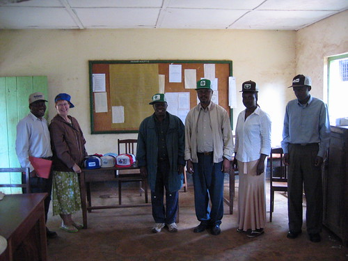

I slept better and am doing a better job of quieting my busy mind. I was awakened by a dream wherein Micah and I went to a lecture by Gertrude Stein. I got up, got dressed, had breakfast (one piece of white bread w/peanut butter, one small banana, and a cup of weak coffee). We went to Bishop Moshi and gave seed caps to the faculty and staff, then drove back to Umoja Hostel in Moshi.

Right this very instant \[as I was writing this at the end of the day\], I wish I still smoked. It would be so nice to stand outside here or sit in the courtyard and have one cigarette before going to bed. But alas.

This morning, after we got here, I took a shower and shaved. Then we went to lunch at the Coffee Shop. The menu there was very similar to that of a European-style café, and I am quite sure my toasted bacon, tomato, and cheese sandwich was grilled on a George Foreman Grill.

After lunch, we walked around some and looked into a shop or two, but it started to get hot, so Mom and I came back to the hostel. We sat in the courtyard and read and talked. I came to my room and hand washed my undergarments. Then there was more sitting and reading in the courtyard. Later, I kind of wished I had continued to walk around with Sara, Micah, and Dad, but when was the last time I was able to sit outside and read? There was a church service while I was sitting and I got to hear, among other songs, “The Battle Hymn of the Republic” sung in Swahili. Manifest Destiny took on new and twisted meanings. The singing was beautiful, unaccompanied, four-part harmony.

Tonight we went to visit Sara’s friend Shaeli. . . .

They were volunteer partners when Sara came here the first time. We went out to the suburb of Soweto to Shaeli and her husband Humphrey’s house. So . . . so . . . so . . . I’m not sure how to talk about wealth in Tanzania. Nor am I sure how to talk about how Humphrey showed us around. Let me just say that the obvious opulence (comparatively) of their home, mixed with the way Humphrey acted toward both his home and his wife (or my perception thereof) mixed with what appears to be—earlier today, I asked if an apt description of Tanzania would be “19th Century rural America with cars and mobile phones,” and Mom said she thought more like 1950s rural America—a very patriarchal gender-relations situation, mixed with the fact that Humphrey would sometimes stop paying attention to the conversation (whether because he was bored or couldn’t understand our sloppy and idiom-riddled English, I don’t know), gave me the impression that Humphrey was somewhat disingenuous. He seemed, at first, to me to be the slick, frat boy businessman type (which probably doesn’t even exist in Tanzania, at least the frat boy part). At the end though . . . I don’t know, he then seemed very genuine. I’ll admit I know very little about Tanzanian culture in general, or about Chagga (Humphrey’s tribe) culture in specific, so I can’t really comment on my observations without sounding at least somewhat Victorian and imperialist. So.

Allow me to say this: Shaeli and Humphrey have a beautiful house and two beautiful and exceptionally intelligent children. The 2-year-old, Helen, possesses a sophisticated command of her language (I’m assuming Swahili), and Ian’s (the seven-year-old) English is superb. Conversation at one point was about how Helen will tell her father, “I do not want to be closed up in here (their home compound) today! I want to go to work where the other children are.” Then, and I don’t know how we got on the topic, we were talking about how children in Tanzania are more intelligent now than they used to be. We (the Americans) countered with the fact that American children are probably less intelligent than they were a generation ago, and we blamed TV, video games, the internet, a glut of information and no means or ability to use it—the usual suspects. And then Fred (whom I have always liked, but whom I like more and more every day) started talking about his childhood and how he hung out with all of the children of the neighborhood, and how they all shared parents (essentially) and how they made their own toys and invented their own games, because (and he said this in front of Shaeli and Humphrey) they didn’t have compound walls, and their parents didn’t buy them toys, etc. It seemed to me (and again, my perception here could very easily be skewed) that he (Fred) was scolding Shaeli and Humphrey for living the way they do. Did I mention their TV was on the entire time we were there?

So . . . so . . . so . . . the meal at their house was incredibly delicious (yet another feast (At one point, Shaeli said to Sara, “I know how to cook,” but did she cook it? There were at least two helper women there.)), and I had my first Tanzanian beer: Tusker lager. It was just okay. The Castle Milk Stout Mom and Dad had was much better.

\[Some days later, Mom told me how unusual it was that we were offered beer at Shaeli and Humphrey’s. It would seem that most Tanzanians (mostly for religious reasons) don’t drink. Certainly, alcohol was never mentioned at Stephen and Midlasta’s. I ran some of my fragmented thoughts from above past Mom, and she seemed to think that there may have been a fair amount of “trying to appear Western” going on that night, but whether those attempts are a regular, ongoing thing or were mostly for our benefit is anyone’s (Sara, “anyone” in this case means you.) guess.\]
