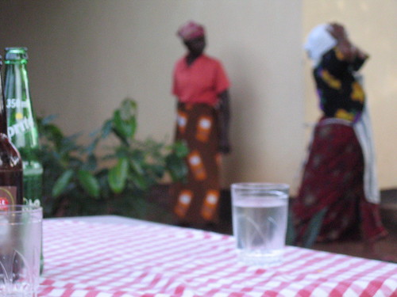

What did we do today? We had a late-ish breakfast, during which I scratched a kitty’s head. I found out that dogs and cats are generally not petted in Tanzania—they’re kept for pest and security purposes, but are not, generally, regarded as members of the family as they are in the U.S. Then we went into town (Moshi) to shop a little. I bought some postcards. Around noon, Mom and Dad left Micah and me at the Coffee Shop (Sara was out at Shaeli and Humphrey’s most of the day). He and I had lunch, and I wrote his postcard to Peter. I bought half a kilo of coffee beans at the Coffee Shop, and if they’re the same as what we drank, then they’re really good \[they were and they are\]. Micah and I then walked back to Umoja Lutheran Hostel, and were not approached by street vendors or beggars once. Earlier, while we were shopping, we talked to a guy about American hip-hop artists, and when we left (after Mom had to tell one very persistent young man to go away), he told us to “Keep it jiggy!”

At 3:00 p.m., Frank Nyunge (sp?) came and picked us up and took us out to Honey Badger Cultural Center. Frank was Mom’s exchange partner the first time she came in 1996 (and he stayed with my parents when he went to the U.S.). There, we met his children: Walter (11), Mary Jo (8), and Faith (2). Mary Jo was born nearly nine months after Frank returned to Tanzania from Nebraska. We had dinner, and then watched some traditional Chagga dancing and drumming. [There was some filthily dressed, poorly coordinated guy who danced with the women, despite the fact that usually only the women dance.](http://static.flickr.com/46/165937291_7657d7c174.jpg) Micah and I were dragged on stage, and I have never felt quite so arrhythmic in my whole life. After the dinner and dancing, we played ball with the children. Then we came back here (Umoja Lutheran Hostel), sat outside for a bit, then came back in and played cards.

I suppose I could write something about why Frank’s wife wasn’t there and how I couldn’t tell if he or his children were sad about that. I definitely need to calm down about trying to decipher the social dynamic. I am not familiar enough with the culture to do it properly, but I won’t stop trying—I’ll just “calm down” about it, whatever that means.
