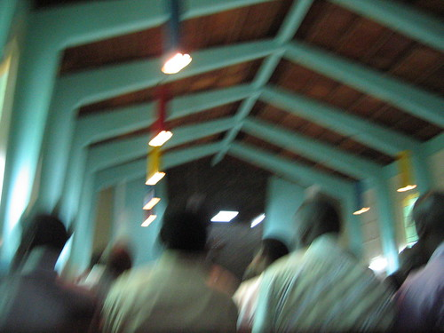
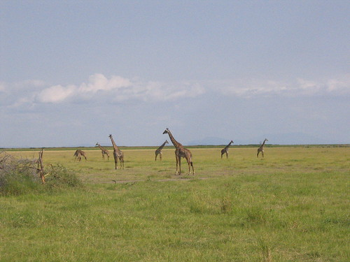

We got up at the crack and went to church. With my limited knowledge of Swahili and the pastor’s use of repetition, I thought perhaps he was talking about the Father, the Son, and the Holy Ghost. Then, trying to remember the ecumenical calendar, I thought maybe today was Pentecost. Turns out it is. We then drove from Moshi to Arusha, and stopped in at Mwangaza, where Mom and Dad dropped some luggage and we saw Shoonie and Jim (and met JoDonna). After that, we drove through Maasai country (which looked very much like the Sandhills of Nebraska except with mountains in the distance and some weird trees) toward Lake Manyara National Park. Shortly before we got there, we stopped for lunch at some place the name of which I didn’t write down and can’t remember. It was the best meal we’ve had so far: tomato cream soup with fresh dinner rolls followed by rice with curried vegetables and some very tender and mildly curried beef (with also maybe some mint?). There was also some delicious fish. A fruit cup (banana, watermelon, and avocado) followed.

Then we drove into Manyara, which sits in the Rift Valley. Fred told us afterwards that we only saw ¼ of the park because of time constraints, however, in that ¼ of the park we saw baboons, Vervet monkeys, black (blue?) monkeys, giraffe, hippos, zebras, elephants, monitor lizards, wildebeest, water buffalo, impala, bushbuck, dik-dik, gazelle, marabou storks, some other kind of stork (yellow billed?), that sounded like mini-bikes when they landed, Egyptian geese, cormorant, pelican, pink flamingos, vultures (I don’t know what kind), and a black and white kingfisher of some kind. My camera doesn’t zoom very well, and I only took 27 pictures, but the ones I took were pretty good. We’re now at Karatu Hostel, and I’m not feeling very good. I had a touch of the diarrhea not long ago. Now I’m going to take a shower and go to bed. Some water and some sleep should fix me right up. Tomorrow, we drive into Ngorongoro Crater to find more animals.

I missed J a lot today. When we were mostly just hanging out with people, it wasn’t so bad, but now that we’re on Safari, I really wish she were here. She would love it. (She would have loved Ndoro Falls as well, but as I was looking at some elephants today, I couldn’t stop thinking about her and I miss her terribly. I was very happy to get email from her today when we stopped at J. M. Tours’ office.)
