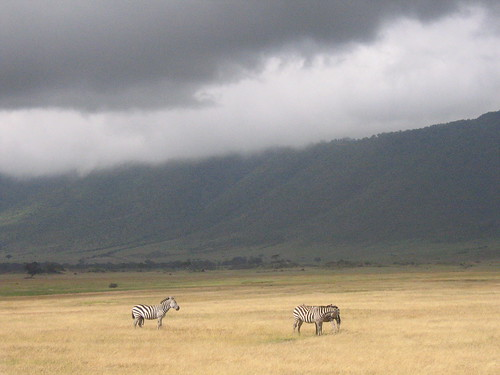
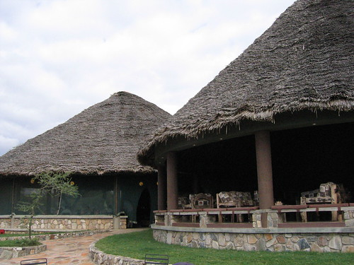

Tomorrow's date is the number of the beast. I'm told there are a lot of elephants here in Tarangire National Park.

This morning, we left Karatu Hostel and drove up into Ngorongoro Crater. The drive up was very foggy, through steep rainforest, and we couldn't really see anything. The drive up made both me and Micah a little nervous. For much of the way up, we followed a bus on its way from Arusha to Lake Victoria. I guess up and around the rim of the crater is the quickest route. When we got to the top of the rim, we couldn't see down into the crater. We drove around the rim in dense fog and then began our descent. From the rim to the base of the crater is 600m down. Maybe 50m down from the rim, we drove out of the fog, and we could see the entire bowl, which has a 20km diameter. We drove around in that bowl all day. The canopy of cloud slowly dispersed, and we had extremely good luck finding and photographing animals. I doubt I'll be able to recall everything (my photographic record, while not of the highest quality, should be complete), but we saw a number of antelope, many many zebras, lots of wildebeest, water buffalo, pink flamingos, elephants, two lionesses by a watering hole (Sara spotted them first), a lion sleeping on top of a hill (we had a small argument about whether he was a rock or not before the wind blew his mane)(he also eventually moved, and we got within 10 yards of him), a group of lionesses at a dried watering hole, three different rhinos (one exceptionally closely), lots of hippos, and two cheetahs (we watched one chase a zebra, which are usually too big for cheetahs to take down). In short, and to repeat, we had very good luck seeing animals inside of Ngorongoro Crater.

\[It seems to me now, typing this out of my notebook, that I could have done a better job of journaling. The previous paragraph is little more than a list of animals we saw. I suppose I could trot out the old ìbut I was tired when it came time to write down the dayî excuse, and even though it would be true, tiredness isn't much of an excuse for laziness. I call myself a writer, but I don't actually do it. I might also be a little hard on myself from time to timeósurely a travel journal is usually just a set of quickly jotted-down notes one uses as reference when writing the full story later, right? Anyway, instead of merely refashioning the piss-poor original into something a little more compelling and then passing the more compelling version off as the original (which would be my prerogative as a writer (so-called or not)), here's a mostly fleshed-out version of our day in and around Ngorongoro Crater (which was one of the nicest days we had in a string of very nice days):

I woke up exceptionally early, which is pretty much what I have done every day. Instead of a seemingly crazed, barking dog or the muezzin, today I was awakened by church bells, and since I was up exceptionally early, I then tried to get the rest of my family to join me. They were having none of it. I guess I sort of paced around Karatu Hostel for a while, waiting to go to breakfast. I took a picture of one of those strangely sparse, upside-down looking trees, and was, at one point, greeted by one of the party of missionaries (Missouri Synod Lutheran?) who stared at us so brazenly at dinner last night (I guess inviting your African driver to sit down at the dinner table with you is a no-no). We invited Fred to share breakfast with us as well, and then had pretty much the same breakfast we've had every other day. After breakfast, we picked up our boxed lunches from the fine folks at Karatu (You know, I say ìfine folks at Karatu,î but the one woman who served us in the dining hall was kind of dour, and the woman with the droopy eye at the front desk never smiled and was also kind of douróbut that was just their demeanor, wasn't it? The food was good, the rooms were clean, and the hostel was really very nice (in fact, the hostels we stayed in were much more like mom-n-pop hotels than they were like hostels), so why am I complaining about a little dourness?) Hostel, and got in the car. ¶ The land around Karatu and Ngorongoro is quite a bit different than the land around Moshi, Marangu, or even lake Manyara. Yesterday, after we left Manyara, we drove up a wall, basically, on the other side of the Rift Valley, into where we are now. The earth is still a very volcanic red, but it seems to be a shade darker. Because our elevation is higher, the clouds are lower, and the sky seems to be closer. Instead of grasslands and cornfields, we've seen wheat and fields of flowers (many of which will be dried before export—these are/are not the same flowers the daily KLM flight picks up?). ¶ Yesterday we went up up up to get here. Today we went up even farther. Our ascent up the outside of the crater was through densely foggy rainforest. We couldn't see very far in front of our truck, and we couldn't see very far to the side either. Every once in a while, the view to the side would open enough for us to see that the road was very narrow and that the amount of space between the road and a precipice was nearly nil. There were definite moments when both Micah and I (in the back seats) were very nervous. Our fear was enhanced by the fact that most of our ascent was spent behind a bus from Arusha to Lake Victoria. Fred explained that despite appearances, around the rim of the crater was the most direct and fastest route between the two places. I should explain that busses both big and small are routinely overflowing with people and things. There were no young men hanging off the side of this bus, but there was at least one guy who got off and on the bus when it was in motion: At the crater's entrance gate, he jumped off and put a block behind the front wheel, and he removed it and jumped back on the bus as it began to move away again. The bus made us nervous because we've all heard stories about overflowing busses falling down mountains in developing countries (In fact, there was a bus accident on the road between Moshi and Arusha the day before Dad and I left. 54 people died in that accident.). ¶ When we got to the inside rim of the crater, the fog was so thick we could see almost nothing. We stopped and got out to use the facilities (in national parks and conservation areas (Ngorongoro Crater is a conservation area), it is not advised to just get out of the car anywhere to pee. Lord knows what might be lurking in those bushes, and Tanzanians have folk stories about mongooses, who are highly specialized snake-killers, biting the penises off of little boys), and our truck was almost immediately surrounded by young Maasai warriors who wanted to sell us things. I went to the toilet, and while there, saw my first cactus tree: bark on the bottom, cactus above. It freaked me out some. When I got back to the truck, it was no longer surrounded by Maasai warriors, Sara and Micah were. I really wish I had a picture of that scene. ¶ Before we started our descent, Fred told us that several cars full of people (mostly Americans) he was driving had refused to go any farther once they saw the road down into the crater. The road down is very narrow and very steep, and usually, once you descend below the lip of the crater, you also descend below the blanket of cloud on top of the crater, and then you can see everything. Fred said he always let the people protest as he kept on driving down. ¶ Morning in the crater was marked by the low-hanging clouds at the crater's rim. They slowly dissipated over the day, but never fully went away until about the time we drove out of the crater. . . . ¶ ¶ It could, of course, go on and on like that for a whole book. It would contain a list of all the animals we saw, the argument about whether the [lump on top of the hill was a rock or a lion](http://static.flickr.com/60/165963037_0b9f41123f.jpg) (it turned out to be a lion), and at least a mention of how we had to eat our boxed lunch in the car or the large, black kites in the tree by the pond would have swooped down and taken lunch right out of our hands. But instead of going on and on like that for a whole book, and particularly since I've run out of steam, I'll finish typing the rest of what I wrote in my notebook on June 5, 2006.\]

We drove up out, stopped at a lodge built on the lip, took pictures and then headed for Tarangire Lodge. On the way there, Fred stopped at a shop with lots and lots and lots of carving. I bought an ebony walking stick. Originally, the guy asked Tsh35,000 for it, but Fred helped me talk him down to Tsh20,000 or $20.00 (approx.)

Tarangire Lodge is fabulous. There's a lounge and a dining area, both open and both with gigantically tall ceilings. There is also a swimming pool. Outside of the lounge and dining area, there is a large terrace that looks out over Tarangire National Park. The view is expansive and fantastic, and one can sit in the lounge or on the terrace and watch the wildlife move around on the plain below.

We are staying in tents. Those tents are sheltered by wooden huts with thatched roofs. At the back of those huts is a bathroom, and while the bathroom isn't exactly open air, it is close enough that I felt a mild breeze as I was taking the hands-down best shower I've taken since we got here.

If J and I ever come to Africa together, I will bring her here. She would love it.

