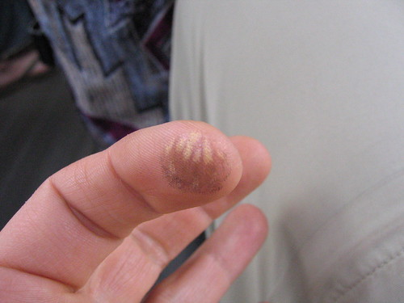
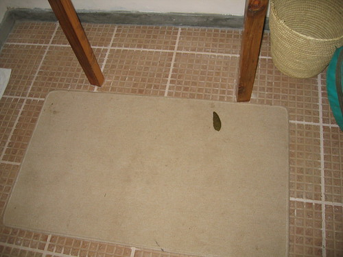

I woke up with the birds and the sun this morning and then watched Vervet monkeys run by my tent and watch me watch them.

We had a wonderful, half-western breakfast (I should have written about the glories of last night's dinner, but Sara is chronicling the food), and then left on Safari through Tarangire Park. Our incredible good luck yesterday affected us today, and we saw virtually nothing in the way of wildlife . . . several Impala, lots of birds, and we did see some baby elephants, but only from a distance because Fred says the elephants here are mean. He (Fred) then took us to the poacher's hide, which is a hollowed out Baobab tree. It was awesome. He drove like a bat out of hell after that, but we stopped and he told us the story of how a leopard killed a child at the lodge last year. He was there, and thanks to his quick thinking, he and the father of the child were able to scare the leopard away from the child's body before it dragged it up into a tree (as leopards do). I don't know if Fred really wanted to tell the story, but he did.

Now I'm sitting in the lounge, looking out over the park, writing this . . .

And I spent the rest of the afternoon and evening watching the view subtly change. It was quite relaxing and beautiful. There was almost no one around. I wrote 12+ postcards. I drank a Coke. I talked to Mom and Sara.

As it was getting dark, Dad and Micah returned from their afternoon/evening with Fred in the car. They did some serious off-roading since there were no (fragile) women with them. I was torn, but am confident I made the right decision after previously lambasting Americans for being both unable and unwilling to appreciate subtlety and nuance. Which is not to say our morning Safari didn't include those things. The mama fowl with her baby chicks might have gone unnoticed by other groups. I don't know. The last time I went down this pseudo-logical road, I was roundly criticized for being elitist.

(Oh! Today was the day of the beast, right? Well, I doubt the world ended in the U.S., and the closest we got here was Fred's story about the leopard incident this last autumn.)

\[That, of course, is a blatant, but also accidental misrepresentation of the truth. I had to deal with the leavings of several beasts: When we returned from our morning Safari, I went to my hut/tent to find that some Vervet monkeys (very likely the same Vervet monkeys with whom I had made eye contact at sunrise) had come to my tent/hut while I was out and used the bathroom and front porch. Thank goodness monkeys aren't quite agile or strong or smart (or they just haven't yet figured out) enough to unzip tents, or there could have been real trouble. Anyway, they left a present of poop and pee on my porch, and they left two presents of poop in my bathroom. They also tried to eat my soap. I went to the front desk and told the man there what had happened. He was extremely apologetic and I told him that was unnecessary as he had no control over the monkeys. He laughed and suggested that perhaps I should just think of it simply as my wild experience present from Tarangire Safari Lodge to me. I agreed that was a good idea.\]

