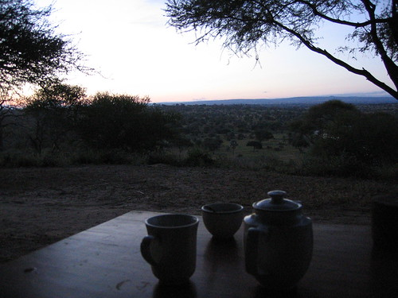
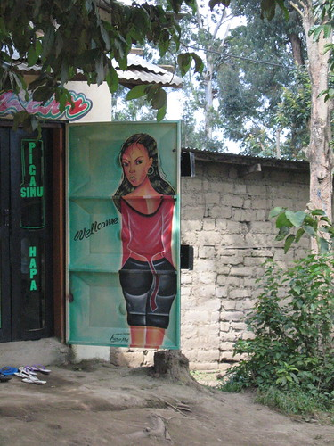

I was awakened by the man who brought coffee to my tent this morning. I jumped up, got dressed, went outside, watched the sun rise, and drank coffee. I was eventually joined by the rest of my family. \[I can think of very few things more relaxing and envigorating at the same time.\]

We went to breakfast and then out in the truck. Today was much like yesterday in that we didn't see much. That was fine because we really were spoiled in the crater. We did get dangerously close to a mama elephant with two children (one teenager and one baby). That was super awesome, and I got some great pictures \[[1](http://static.flickr.com/66/165993073_0d390a4be8.jpg), [2](http://static.flickr.com/78/165993352_a7b6c552cd.jpg), [3](http://static.flickr.com/72/165993838_0056f53197.jpg)\].

We had lunch at and said goodbye to the lodge. Later we found out that the staff there made a point of telling Fred how nice we were.

We drove to Arusha and Mwangaza. After seeing the baby elephant, the highlight of the day was dinner at Khan's. By day, Khan's BBQ is an auto parts store. By night, it's a street side BBQ. It was a lot of fun, and the food was good too. It seemed like everyone (who was anyone) was there, but that's probably only because a U.N. truck stopped by and picked some food up (the U.N. tribunal for war crimes in Rwanda is in Arusha). \[Khan's BBQ: [1](http://static.flickr.com/78/165997318_e79458d538.jpg), [2](http://static.flickr.com/59/165997664_539760fb4a.jpg), [3](http://static.flickr.com/70/165997924_91c6c39f89.jpg)\]

I am ready to go home. This is awesome, and I hope to go out shopping with Fred tomorrow, but I'm tired and I miss J a lot. I suppose Saturday will come soon enough.

Also, will I ever be able to describe Ilborou Road?

