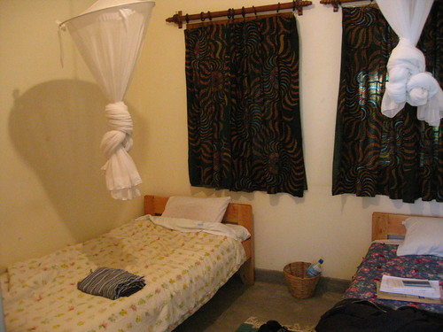

Slept in. Got up. Took Imodium. I'm not feeling so hot. My nose is also dry and bloody. Pretty yucky. I'm feeling so yucky, in fact, that I'm resorting to writing sentence fragments. Something. Sara, Micah, and I had breakfast outside. Dad joined us for a bit, and then the four of us joined Mom and Shoonie and Alan, and we all went into town. The first place we went was this strange European place with lots of candles and decorative things. They had some western, plastic toys there too: an action figure that was built around the idea of really buff computer nerds who hack into the bad guys' systems and then have to fight their way out (because access to the bad guys' computer network can only be had locally?). I think it was called CyberMan or Ultra Cyber Corps. or something. I remember the tagline: Information is Everything! Anyway, the shop was frightening, and I didn't like it.

Mom, Shoonie, and Alan went back up to Mwangaza; Dad, Sara, Micah, and I went to lunch at Jambo's Café where I had a lovely bacon and avocado sandwich and bought a super cute stuffed animal elephant. Then Dad and I walked around some before walking back to Mwangaza. I spent the rest of my afternoon installing software on computers.

We went to Ilborou Safari Lodge for dinner. And I spent my evening with computers again. It was nice to be able to help. I think what they're doing here is a good thing.

Tomorrow is a day of travel, and I doubt I'll get much written. I will try though.
