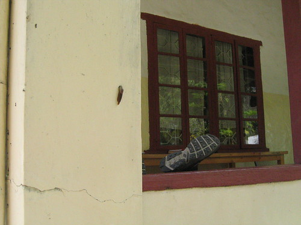
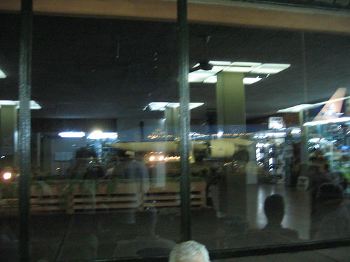

Today has been a pretty lazy day. We got up and went to breakfast at the Arusha Hotel. It was very European and much like Litfass (without the method of ordering). \[Funny, isn't it, how a European-style home dècor shop is "frightening," but a European-style breakfast isn't?\] I stopped in the hotel shop just to look, and found some of those cute, Maasai, troll-like doll things with the beaded necks. I had also just given Sara and Micah the rest of my shillings. So I had to use my bank card. They were $5.00 a piece, so I asked for 2, but I had to spend $20.00 if I was going to use my card. The guy gave me five for $20.00. That was nice of him. Then we came back here (Mwangaza), and I showered and packed. We've just been sitting around since.

\[Around 5:00-5:30, we drove back into town, and Dad and I caught the shuttle to the airport. While we were waiting for the shuttle (which was one of those mini-mini-vans that act like busses), Mom talked about how one time when she took the shuttle, it had a blowout on the way. Our shuttle was packed full with people and luggage. We had a blowout on the way to the airport. Shortly after the driver replaced the tire, the woman next to Dad told us that just the day before, there had been a horrible bus accident on the road we were traveling.

We got to and into the airport without incident. I was given a little trouble about the ebony walking stick I was carrying (_You could use it as a weapon._), but when I pointed out that the woman in front of me could use her cane as a weapon, the guy backed down.

Our flight from KIA to Schiphol was long and uneventful. Dad and I separated in Schiphol, and my flight to Chicago was long and uneventful.

I was very glad to be home when I got here.\]

