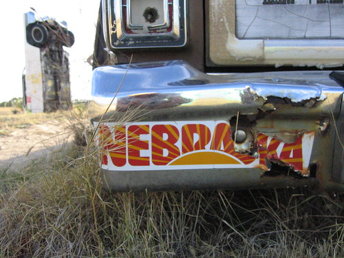

I like this picture. I took it last week when Dad, J, and I visited Carhenge. I think it would be too easy and exceptionally trite to attempt to talk about this image in terms of how I feel about my return here.

This blog, this blahg, which began its life as an avoidance of the confessional, has slowly but surely gone the way of all vanity projects. Just two weeks ago, I was thinking about how I could use this space to keep my friends informed of my doings in the hinterlands, but that thought now strikes me as foolish. This space needs one of two things: either a return to quirky abstraction, or a swift death.

I've asked for your input before, is there any point in asking again?
