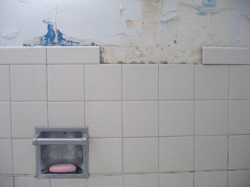

I thank you all for your feedback to the previous post. Considering this blog's tagline, it seems to me the first comment might be the most useful. Or not.

I think there might be a third way: d) All of the above.

I really would like this to be a more dynamic place--a sort of collaborative act with the reader if you will, but you can't force people to participate.

Here's a picture of (part of) my bathroom:

