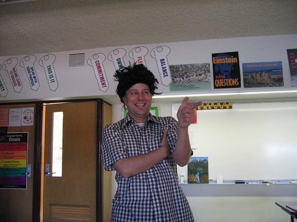

Of course that's the idea. Do you expect me to create in a vacuum (cave)? I'm certainly not comparing myself to either of these great men, but Shakespeare stole all of his plots, and had Alexander Fleming not left a window open, we wouldn't have penicillin as we know it. I'm not without ideas; I'm just trolling for more, so that I can mold and shape them to my own purposes.

Here's a picture. I didn't make this wig, but I certainly used it and changed it and made it my own.

