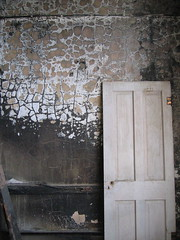

Yesterday, I visited my friend Scott N. He owns a couple of buildings in downtown Gering. One of them used to be an apartment building. It burned some years ago before Scott bought it. The damage was mostly superficial, so there was no problem walking around in the part of the building he hasn't fixed up yet. I took some pictures.

After that, Scott ended my weeks-long quest by giving me a small plastic watering can for my house plants (there was not one to be bought anywhere in this town, and it would seem there's a season on houseplant accoutrements), and we drank a beer on top of the marquee of the other building he owns: an old movie theater.
