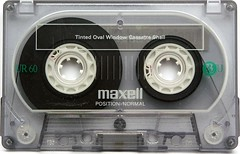

My friend Radioredcontroldeck has started updating his podcast "[Emergency Podcast Networx](itpc://homepage.mac.com/mkudlacz/podcasting/recent.xml "subscribe!")" again after an extended absence wherein he moved from Chicago to NYC.

I'm really glad he's started publishing again because I've always really liked what he does (even when he was doing it as "This is a Pocket Protest." _see also_: [this post](http://www.rocket2nowhere.com/blahg/2005/09/09/this-is-a-rocket-protest/ "This is a Rocket Protest")), which is make a deceptively simple, 45ish-minute, themed mix of music. Receiving a new installment is like getting a carefully thought-out mix tape in the mail, which, I suppose, is why the podcast's subtitle is "on the matter of mixtapes." The songs are carefully chosen. The segueways are smooth, often surprising, and always thought-provoking. This is the sound of someone thinking through a question by putting one song after another, by doing that which those of us of a certain age did for hours and hours on end in high school: make a nice mix that might mean something to someone other than the maker.

I suggest you subscribe and listen carefully. It's well worth it.
