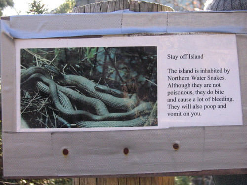

I saw this sign while taking a walk with J and her parents at Lake Katherine in Palos Heights, IL this weekend:

I had never heard of Northern Water snakes before, and my first thought was "is this real or just a ruse to keep people off the island?" I did some quick research, and found [this](http://en.wikipedia.org/wiki/Northern_Water_Snake "link to full article") on Wikipedia (which means it could be a complete and total lie, right?):

> Northern Water Snakes. . . . defend themselves vigorously when they are threatened. If they are picked up by an animal, or person, they will bite, as well as release excrement and musk (bad smelling liquid). Their saliva contains an anticoagulant which can cause its wounds caused by biting to bleed profusely.

Anyway, I think that's a great defense, and I may adopt it myself--seeing as I have so many predators.
