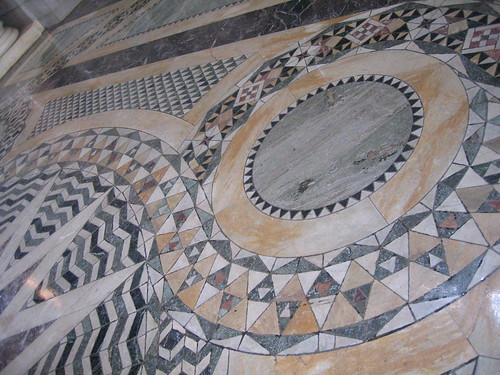
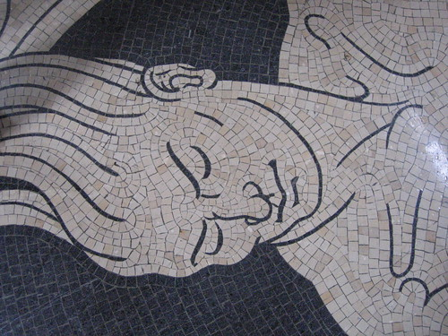

J and I visited Nebraska's lovely state capital, Lincoln, this past weekend. (If you live in Lincoln, please don't be offended that we didn't call. We wanted to, but there just wasn't time.) While there, we also visited Nebraska's lovely state capitol. You can look at all the pictures I/we took (I got a little crazy about the animals on the rotunda's floor) by going [here](http://www.flickr.com/photos/shrocket/sets/72157600029734814/ "to the slideshow!"). You can get some good information about Nebraska's lovely capitol building by going [here](http://www.capitol.org/index.html "www.capitol.org"). If you're ever in Lincoln, I highly recommend taking a tour. It's free and the building is gorgeous (and if I remember correctly, it was once and may still be listed as one of the seven architectural wonders of the modern world).

