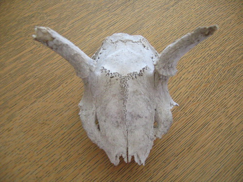
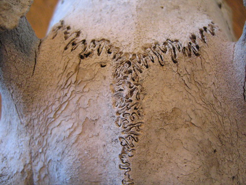
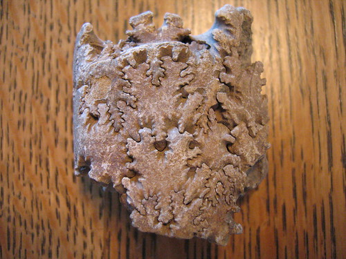
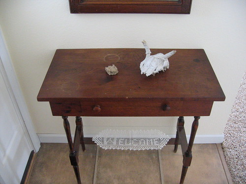

I recently found this fawn's skull while walking through the ravines by my parent's house.

When I picked it up, I was immediately drawn to the cranial sutures:

because they reminded me of this fossil, which might be ammonite (?), and which has been in a box in my parents house forever, and which I admired as a child:

So I put them together on the entryway table, and my mother hasn't yet said anything about greeting guests with a _memento mori_.

