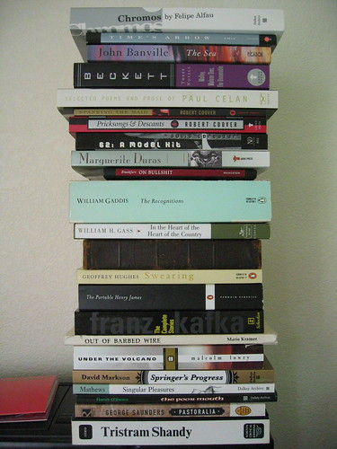

[boingboing.net](http://boingboing.net "a directory of wonderful things") pointed me to [the Reading Stack group on flickr](http://www.flickr.com/groups/readingstack/pool/ "lots of people's silly stacks"). I couldn't help myself. Hopefully someone will look at my benoted picture and write a comment to me about how it looks as though I'm trying to show off. Who knows, on the one hand, maybe I am. On the other hand, maybe it's just that most of these books are books I bought when the best bookstore in Chicago had its going out of business sale.
