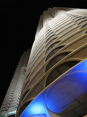

  
[Marina City at night close-up](http://www.flickr.com/photos/noelcornell/507231044/)  
Originally uploaded by [Noel Cornell](http://www.flickr.com/people/noelcornell/)

I'm back in Chicago for a while, and even though I will miss Scottsbluff's topography and my parents and my friends and my students (in no particular order), every breath of polluted air here is somehow regenerative. If you're in Chicago and reading this, get in touch with me and we'll go out for a beer. It's going to be a summer. Yes it is.
