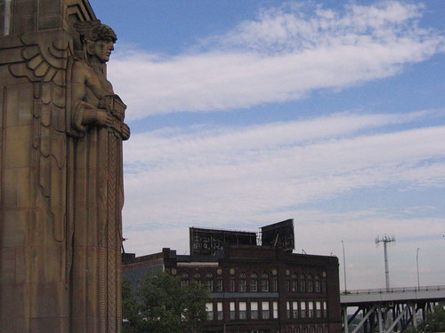
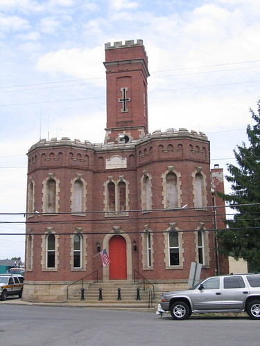
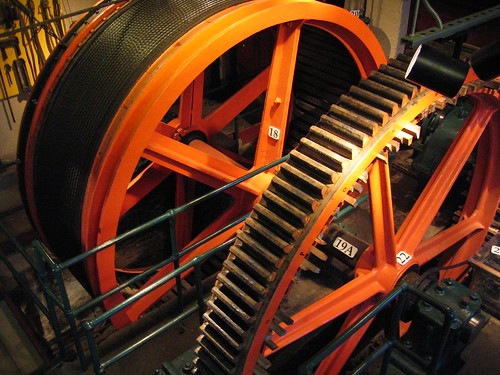
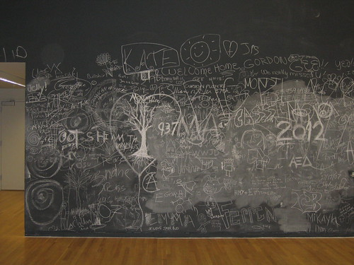

Last week, I accompanied J on a trip to Cleveland, OH, Clarion & Pittsburgh, PA, and Columbus, OH, in that order. I hadn't been to any of those places, and so I was excited to see them. I took lots of pictures at the beginning of the week, and slowed down as the week progressed, so that by the time we were in Columbus, I took very few pictures, and mostly of the hotel room (because I couldn't take photos in the art gallery I visited on OSU's campus, pfffft!).

Our hotel in Cleveland was across the street from Jacob's Field. The night we were there, the Indians were playing the White Sox. We didn't go. Instead, we walked across the bridge and into Ohio City, Cleveland, a well-preserved neighborhood of bungalows and cottages. We ate dinner in Ohio City, then walked across another bridge, through downtown, and back to our hotel. Here's a picture of part of the first bridge (click on the picture to see a slide-show of all my Cleveland pictures on flickr):

The next day, we drove to Clarion, PA. I wandered around town (which reminded me of Crete, NE--college on a hill, curmudgeonly locals), and settled in a coffee shop, where I read for a while. Here's a picture of the (old?) jail in Clarion:

After J was done at Clarion University, we drove into Pittsburgh, parked, and took the Duquesne Incline up the side of Mount Washington. The Incline is a funicular railway, and was designed and built by Samuel Deischer, the same man who designed the world's first ferris wheel for the 1893 Columbian Exposition in Chicago. We ate dinner on top of Mount Washington, and watched a thunderstorm move across the Allegheny and Monongahela river valleys. Here's a picture of the inner workings of the Duquesne Incline:

While in Pittsburgh, I visited the Andy Warhol museum, which, I'm sorry to say, was fairly disappointing. There was, however, one gallery filled with his silver clouds and a couple of oscillating fans. It was fantastic. Here's a video I made:

After leaving the museum, I walked north in a neighborhood called "Deutschtown." After spending an hour or so in the only coffee shop in the neighborhood, I walked back south into downtown Pittsburgh. J picked me up there, and we headed to the south side, where we had a good dinner at a Lebanese restaurant.

After dinner, we drove to Columbus, OH. I spent much of the next day in the hotel room reading. Late in the afternoon, I ventured out for some food, and ended up walking through the galleries at OSU's [Wexner Center for the Arts](http://wexarts.org/ex/ "exhibitions"). I saw work there by Hope Tucker, [Rain Harris](http://www.theclaystudio.org/gallery/?gallery=harris "look at this!"), and Robert Beck. Photography wasn't allowed in the galleries, but I took a picture of this part of Beck's installation:

I figured that since it wasn't entirely his work, it would be okay. Click on the photo to be taken to a slideshow of all the Clarion/Pitt/Columbus photos I put up on flickr.

That evening, after some really good sushi, we drove around the Germantown/Brewery District of Columbus. I don't know why I didn't take pictures there. The small houses, narrow streets, and brick sidewalks were pretty awesome.

J and I came back on Friday night. We ran into traffic on the Skyway. J dropped me and my bike off at Foster and the lakefront, and I rode to the Book Cellar, where I stood in line for a while and bought the last Harry Potter book. I finished reading it at 3:00 a.m. today. I'm tired, but it was worth it.
