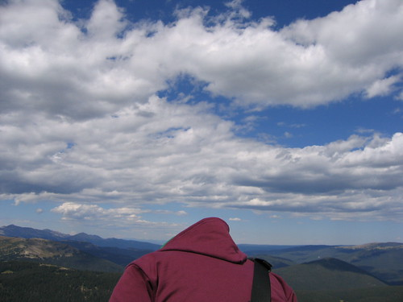

I am now safely ensconced in Denver. I have my little basement apartment. I have an awesome housemate. I have my books, my notebooks, my pens, my computer, my music, my bike, and my car. For the time being, I have my love, but she'll be leaving on Monday. Two days after that, I'll start orientation at DU.

Yesterday, we drove up into Rocky Mountain National Park. I shouldn't have to tell anyone how beautiful the mountains are. [Here is a link to a slideshow of our pictures.](http://www.flickr.com/photos/shrocket/sets/72157601784314120/show/ "slideshow!") Despite the mountains' obvious beauty, I still maintain that the Sandhills of Nebraska are more beautiful. That is mostly because the mountains are _obviously_ beautiful, whereas the Sandhills are beautiful in subtle and nuanced ways (and may also be an acquired taste).

Rocky Mountain National Park makes up for the fact that Denver doesn't have Lake Michigan. I'm not sure I'll find anything that makes up for the lack of public transportation in Denver (the Light Rail notwithstanding), or the fact that most neighborhoods don't have stores or restaurants within easy walking distance.

The dual-personality-artist is a cliché that doesn't need to be explored here, but let me just say that the relative nearness of western Nebraska (and my parents) along with its (and their?) rural charms will more than make up for what Denver lacks in proper urbanicity. Wait . . . ?
