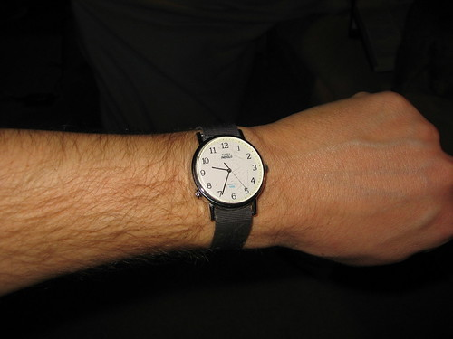

Since I started biking to school and taking classes in rooms without clocks, I have thought maybe I'd like to go back to wearing a wristwatch. I haven't worn a wristwatch in, what, 12 years?

So I wrote my family and asked if anyone was in possession of my grandfather's watch. Luckily, my aunt and uncle were. They packaged it up and sent it to me.

I have been wearing the watch since I got it. Or, I got it in the mail, finished the thing I was working on, left the house to have a new battery put in, and then started wearing the watch. Twice now, and for no apparent reason, it has stopped working. Both times, however, it has started again. It continues to tick at this moment.

The watch is a cheap cheap Timex Indiglo with an even cheaper band. The crystal is scratched. There's some kind of schmutz both on the watch and on the band (that I can't quite clean off). If it were to stop again and for good, it would probably be cheaper just to buy a new watch, but I think I'd take it to a repair shop first. All of its cheapness makes it a better watch. In other words, it is not the sentimental aspects of the watch that give it the most value, even though said aspects are themselves very valuable. No, somehow, the fact that it's probably not worth saving makes it that much more worth saving.

It's probably full of sawdust.

I think it looks as though it belongs on my arm (but it is the only cheap thing that belongs on my arm, and the only other thing that belongs on my arm at all--besides sleeves--is far from cheap). It's the right size and shape. The face is unadorned. The hands are plain. Aside from the glowing at the press of a button thing, there is nothing superfluous about this watch. It simply does what it is supposed to do--show me what time it is--and nothing more.

I couldn't be more pleased with my return to the land of the time-shackled.
