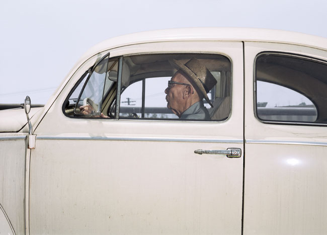

Thanks, [boingboing](http://boingboing.net "gniobgniob"), for pointing me to Andrew Bush's website.

[Andrew Bush](http://andrewbush.net/index.html "Andrew Bush's website") is an artist (mostly photography) who has taken many pictures of people while they are driving.

")

On his website, there are two sections where one can look at these images—both can be found in the "[Vector Portrait](http://andrewbush.net/vector%20A.html "Vector Portraits")" section. Once there, if you click on "99," you will see 99 unlabeled portraits. If you click on "Enter," however, you will be taken to a page called "66 Drives." These portraits (most of them) _are_ labeled. All of the labels adhere, for the most part, to the following convention:

> Person verbing on X road in X location at X speed on X date at X time.

As I was looking through "66 Drives," I was struck by the verbs in these labels. Mostly, I think, because the verbs are the only real variable within the labeling convention, the only place where Bush is allowed, within the constraint he's set himself, to add description or commentary to his image. Here is a list of all the verbs from "66 Drives" in order (if you start with the top-left image and proceed using the right arrow)(I have included objects when the verb is transitive, as well as some prepositional phrases, adverbs, and infinitives where necessary):

> venturing • caught in traffic while heading • traveling • taking her time • fleeing • driving • continuing • proceeding • heading • drifting • gliding • traveling • drifting • traveling • meandering • going • rolling along (and whistling audibly) • traveling • rolling • passing through going about her business • traveling • heading • going • racing • returning • driving, reading, clinging • cruising • \[blank\] • \[blank\] • being released, accelerating, heading • traveling • facing • moving • \[blank\] • heading • finding his way • driving • waiting to proceed • guiding her automobile • traveling • about to cross a bridge • traveling • heading • trying to look after son • heading • bopping • wheeling • driving • traveling • traveling • keeping it moving • pausing • driving • cruising • heading • \[blank\] • heading • ramping down • driving • traveling • \[blank\] • \[blank\] • \[blank\] • traveling • \[bank\]

As you can see, most of the verbs are in the present participle form. This form implies/imparts motion to an otherwise static photograph. The verbs also pretend to comment on what the person in the photo is doing, but because of the nature of the photograph (of _strangers_ in cars, a place where we think of ourselves as alone), this commentary comes from the outside--in other words, every verb is a guess, a projection, a label.

A whole paper could be written about these photographs and their labels, about the differences between motion/change and stasis, and about the verb choices Bush made (or didn't make). Perhaps someday I'll write that paper. In the meantime, however, I will content myself with simply being really impressed with both the fantastic photography and the fact that it's not very often a writer will provide such an obvious example of his linguistic choices.

.
