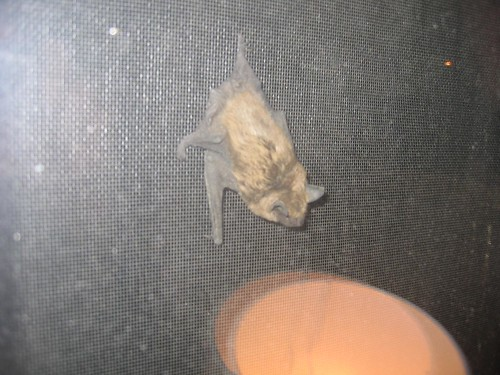
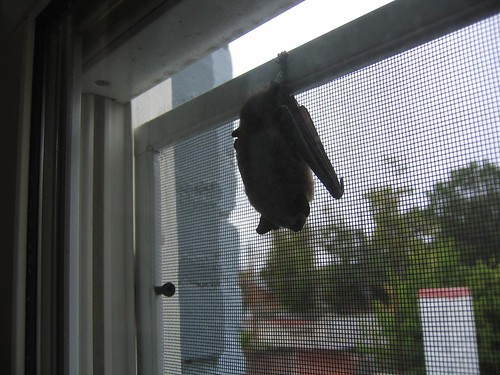

This morning at 4:00 a.m., I was awakened by a noise. I got up, checked the house, found nothing, and went back to bed. As I was falling asleep again, I heard the rain and thought, "Oh, it's raining." I dozed a little and then heard a scratching and thought, "Oh, there's some scratching outside." I dozed a little more and heard a different noise, and thought, "Oh, there's a bat in our room."

I got up, and J asked, "What is that noise?" I said, "I'm not yet sure, I want to see it." I got the flashlight, and shined it in the waste basket (which is lined with plastic and scratches nicely) and yes, yes, there was a bat in our room.

I covered the waste basket, took it outside, uncovered it, and let the bat loose. It flew away.

We went back into the bedroom, and J said, "Let's make sure there aren't more." She's very smart like that. So we turned on the lights and searched around and lo and behold! there was _another_ bat clinging to the _inside_ of the screen (between the screen and the window)!

We closed the window. And then watched the bat. For too long. It was four in the morning. But wow, they're interesting creatures.

The bat was still there when I left the house today at noon.

You can see, quite clearly, the gap between the top of the screen and the wood of the window. This is where the bats crawled in. Needless to say, we have put in an order for better fitting screens with our landlady.

Adventure!
