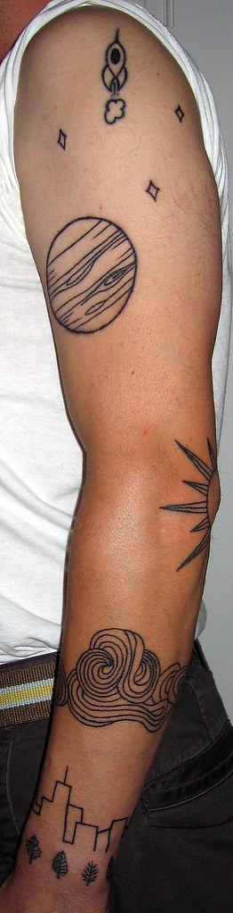

It is really difficult to photograph tattoos! Oh my goodness.

Okay, so, here's the deal: Ten years ago, I got the rocket (to nowhere) tattoo, and _since then_, I have been talking about giving it a somewhere to be going nowhere from. You know, from Earth to nowhere. So I had my friend Nathan Thrailkill design this for me. I wanted it to be all black line like the rocket. I wanted there to be the earth (trees and city), the sky (clouds), the sun, the moon (the only thing yet left to be done), Jupiter, and some undifferentiated space (little stars). Maybe someday there'll be a comet opposite Jupiter. So here it is. It was inked by Grendel at [Peter Tat2](http://petertat2.com/ "their website") on Colfax here in Denver (one of the oldest parlors in town, and also one of the cleanest). Grendel is fabulous. Take her your business.

It's late, and I have little else to say. If you have something to say, comments are below.
